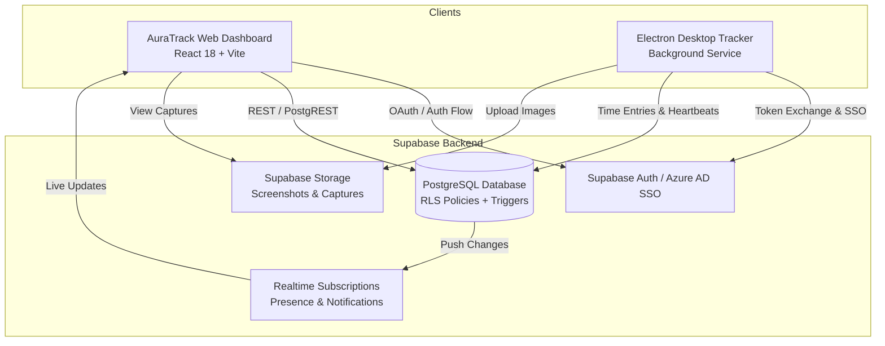

# AuraTrack — Enterprise Time Intelligence & Productivity Platform

<div align="center">


<p align="center">
  <b>AuraTrack</b> is a high-performance, real-time enterprise time intelligence, attendance monitoring, and team productivity dashboard. It seamlessly aggregates work metrics, automated screenshots, webcam captures, and desktop tracker health across distributed teams.
</p>

</div>

---

## 📑 Table of Contents

- [Overview](#-overview)
- [Key Features](#-key-features)
- [System Architecture](#-system-architecture)
- [Tech Stack](#-tech-stack)
- [Project Structure](#-project-structure)
- [Database Schema & Migrations](#-database-schema--migrations)
- [Getting Started](#-getting-started)
  - [Prerequisites](#prerequisites)
  - [Environment Setup](#environment-setup)
  - [Installation & Development](#installation--development)
  - [Production Build](#production-build)
- [Tracker App & Integration](#-tracker-app--integration)
  - [Tracker Version Enforcement](#1-tracker-version-enforcement)
  - [Per-User Screenshot & Webcam Capture](#2-per-user-screenshot--webcam-capture)
  - [Azure AD / Microsoft Entra ID SSO](#3-azure-ad--microsoft-entra-id-sso)
- [Notification System](#-notification-system)
- [Deployment](#-deployment)
- [License & Credits](#-license--credits)

---

## 🌟 Overview

**AuraTrack** provides managers, HR executives, and team leads with 360° visibility into organizational productivity. Built on top of **React 18**, **TypeScript**, **Tailwind CSS**, and **Supabase (PostgreSQL with RLS)**, it offers lightning-fast data exploration, live status updates, granular access controls, automated PDF reports, and direct integration with companion desktop trackers (Electron).

---

## 🚀 Key Features

### 📊 1. Executive Dashboard
- **Real-Time Work Metrics:** Instant overview of daily tracked hours, total weekly/monthly time logged, and billable ratios.
- **Activity Feed:** Live stream of recent work sessions and active desktop sessions.
- **Team Presence Indicators:** At-a-glance status indicators showing who is online, on break, or offline.

### 📅 2. Attendance & Shift Management
- **Clock In / Out Tracking:** Comprehensive log of arrival, departure, and session duration.
- **Status & Anomaly Highlighting:** Visual markers for on-time, late, absent, or incomplete shifts.
- **Advanced Filtering & Search:** Filter records by preset dates (Today, This Week, This Month), custom date ranges, employee name, or department.
- **Multi-Format Export:** Export attendance summaries to CSV, Excel, and structured PDF reports.

### 📈 3. Productivity Reports & Visual Analytics
- **Interactive Charting:** Dynamic analytics powered by Chart.js (Line charts for daily trends, Bar charts for weekly output, and Doughnut charts for project distribution).
- **Time Categorization:** Deep breakdowns of billable vs. non-billable time per user and project.
- **Report Generator:** Export high-resolution, branded reports with custom headers and tabular summaries via `jsPDF` and `jspdf-autotable`.

### 📁 4. Project & Task Governance
- **Project Progress Tracker:** Visual milestone bars measuring logged hours against budgeted hours.
- **Task Allocations:** Assign team members to dedicated projects and monitor individual task progress.
- **Status Filtering:** Quickly segregate active, pending, on-hold, and completed projects.

### 👥 5. Team Directory & Live Activity
- **Member Directory Cards:** Interactive grid showing employee roles, departments, active projects, and current assigned tasks.
- **Presence & Last Active Timestamps:** Synchronized presence information reflecting active desktop tracker heartbeats.
- **Direct Actions:** Quick links to employee profiles, activity histories, and assignment management.

### 📸 6. Screenshot & Camera Capture Intelligence
- **Visual Proof of Work:** Gallery view of periodic desktop screenshots and optional webcam snapshots linked to time entries.
- **Granular Per-User Controls:** Admins can selectively toggle screenshot capture and webcam capture on a per-employee basis from the Admin Panel.
- **Audit-Safe Purging:** Integrated maintenance scripts for automated retention policies and secure deletion of outdated captures.

### ⚙️ 7. Admin Panel & Enterprise Governance
- **Role-Based Access Control (RBAC):** Strict permissions dividing **Admin**, **HR**, **Manager**, and **Employee** capabilities.
- **Group & Department Management:** Organize users into logical teams with delegated managerial oversight.
- **System Settings:** Centralized portal for global policies, tracker download URLs, version enforcement, and telemetry logs.

---

## 🏗️ System Architecture



---

## 🛠️ Tech Stack

| Domain | Technologies |
| :--- | :--- |
| **Frontend Framework** | [React 18](https://react.dev/), [TypeScript 5](https://www.typescriptlang.org/) |
| **Styling & UI** | [Tailwind CSS v3](https://tailwindcss.com/), [Framer Motion](https://www.framer.com/motion/), [Lucide React](https://lucide.dev/) |
| **State & Routing** | [React Router DOM v6](https://reactrouter.com/), Context API (`ThemeContext`, `ToastContext`) |
| **Charts & Reporting** | [Chart.js 4](https://www.chartjs.org/), [react-chartjs-2](https://react-chartjs-2.js.org/), [jsPDF](https://github.com/parallax/jsPDF), [jspdf-autotable](https://github.com/simonbengtsson/jsPDF-AutoTable) |
| **Backend & Storage** | [Supabase](https://supabase.com/) (PostgreSQL 15+, Row-Level Security, Realtime, Storage) |
| **Date & Time Utilities** | [date-fns v3](https://date-fns.org/), [date-fns-tz](https://github.com/marnusw/date-fns-tz) |
| **Build & Bundler** | [Vite 5](https://vitejs.dev/) with optimized manual chunk splitting |

---

## 📂 Project Structure

```
AuraTrack/
├── migrations/                  # Consolidated master PostgreSQL database schema
│   └── 00_auratrack_complete_schema.sql  # Complete idempotent database bootstrap & RLS policies
├── public/                      # Static assets, icons, branding
├── src/
│   ├── components/              # Reusable UI components
│   │   ├── AnimatedCard.tsx     # Framer-motion card wrappers
│   │   ├── Layout.tsx           # Global sidebar, topbar, navigation shell
│   │   ├── Loader.tsx           # Visual loading spinners & placeholders
│   │   ├── NotificationBell.tsx # Real-time notification menu
│   │   └── Tooltip.tsx          # Accessible floating tooltips
│   ├── contexts/                # Global React contexts
│   │   ├── ThemeContext.tsx     # Dark / Light theme provider
│   │   └── ToastContext.tsx     # Global notification toast provider
│   ├── lib/                     # Client services and API utilities
│   │   ├── notifications.ts     # In-app notification creation & subscriptions
│   │   ├── storage.ts           # Supabase storage upload / retrieval
│   │   ├── supabase.ts          # Supabase client singleton & PKCE config
│   │   ├── timeflowStorage.ts   # Custom storage helpers
│   │   └── trackerVersion.ts    # Tracker version check & user-log telemetry
│   ├── pages/                   # Application route pages
│   │   ├── AdminPanel.tsx       # RBAC, user management, system configs
│   │   ├── Attendance.tsx      # Clock in/out records & filterable logs
│   │   ├── Dashboard.tsx       # Executive metrics & quick stats
│   │   ├── Download.tsx        # Tracker download hub & release links
│   │   ├── Login.tsx           # Azure AD SSO & Email authentication
│   │   ├── LoginDirect.tsx     # Direct token exchange handler
│   │   ├── Profile.tsx         # User profile settings & personal stats
│   │   ├── ProjectManagement.tsx # Projects, milestones, and task manager
│   │   ├── Register.tsx        # User registration portal
│   │   ├── Reports.tsx         # Charts, hours breakdown, and PDF export
│   │   ├── Screenshots.tsx     # Gallery for desktop & webcam captures
│   │   └── TeamMembers.tsx     # Team directory, presence & live task status
│   ├── types/                   # TypeScript definitions
│   │   └── database.ts          # Complete Supabase database schema types
│   ├── utils/                   # Shared utility helpers
│   │   └── themeClasses.ts      # Tailwind dynamic styling classes
│   ├── App.tsx                  # Main router configuration & route guards
│   ├── index.css                # Global Tailwind CSS directives & root styles
│   ├── main.tsx                 # React DOM mount point
│   └── vite-env.d.ts            # Vite TypeScript declarations
├── index.html                   # HTML5 application template
├── package.json                 # Project dependencies and npm scripts
├── postcss.config.js            # PostCSS configuration
├── tailwind.config.js           # Tailwind typography, colors, and layout tokens
├── tsconfig.json                # TypeScript project configuration
└── vite.config.ts               # Vite configuration & chunking rules
```

---

## 🗄️ Database Schema & Migrations

AuraTrack relies on Supabase PostgreSQL with strict **Row-Level Security (RLS)** to safeguard multi-tenant company data.

### Key Database Tables
- **`profiles`**: User metadata, company role (`admin`, `manager`, `hr`, `employee`), department, and capture flags (`enable_screenshot_capture`, `enable_camera_capture`).
- **`time_entries`**: Clock in/out logs, durations, active projects, and companion desktop app version strings.
- **`screenshots`**: Records of screen captures and webcam shots linked to time entries, storing storage URLs and timestamps.
- **`screenshot_activity` & `activity_logs`**: Keyboard/mouse interaction rates and window title telemetry.
- **`projects` & `project_members`**: Project budgets, allocated hours, status flags, and member assignments.
- **`groups` & `group_members`**: Departmental groupings and team hierarchies.
- **`leave_requests`**: Employee time-off requests, status workflows (pending, approved, rejected), and manager notes.
- **`notifications`**: Targeted in-app alerts and notifications with read/unread tracking.
- **`system_settings`**: Global system parameters including `tracker_required_version`, `tracker_update_url`, and `tracker_force_update`.
- **`user_logs`**: Telemetry and audit logs for version checks, desktop sessions, and security events.

### Database Setup
To set up or refresh your database instance:
1. Open the **Supabase SQL Editor** in your Supabase dashboard.
2. Run the master migration script: [`migrations/00_auratrack_complete_schema.sql`](file:///d:/Full/Stack/AuraTrack/migrations/00_auratrack_complete_schema.sql).
3. The script will create all extensions, enums, tables, performance indexes, auth triggers, RLS policies, and seed data idempotently.

---

## 🚀 Getting Started

### Prerequisites
- **Node.js**: v18.0.0 or higher
- **npm** or **pnpm** / **yarn**
- A **Supabase** project instance

### Environment Setup

Copy `.env.example` to a new `.env` file in the root directory:

```bash
cp .env.example .env
```

Configure your environment keys:

```env
# Supabase API Credentials
VITE_SUPABASE_URL=https://your-project-ref.supabase.co
VITE_SUPABASE_ANON_KEY=your-anon-key-here

# Optional: Dedicated screenshot storage URL
VITE_STORAGE_BASE_URL=https://storage.auratrack.io

# Optional: Base path (useful for subpath / GitHub Pages deployments)
VITE_BASE_PATH=/
```

> **Note:** The application supports both `VITE_` and `NEXT_PUBLIC_` prefixes for compatibility with existing deployment scripts.

### Installation & Development

```bash
# 1. Install dependencies
npm install

# 2. Start local Vite development server
npm run dev
```

The application will be accessible at `http://localhost:5173`.

### Production Build

```bash
# Build optimized static distribution bundle
npm run build

# Preview the production build locally
npm run preview
```

The compiled output will be generated inside the `dist/` directory.

---

## 🔌 Tracker App & Integration

AuraTrack is designed to work in tandem with the **AuraTrack Desktop Tracker (Electron)**. The web portal exposes APIs, settings, and telemetry endpoints that govern tracker behavior.

### 1. Tracker Version Enforcement
Administrators can enforce desktop app version compliance from **Admin Panel > System Settings**:
- **`tracker_required_version`**: Comma-separated list of permitted versions (e.g. `1.6.0, 1.6.1-beta`).
- **`tracker_update_url`**: Direct download link provided to users when an outdated version is detected.
- **`tracker_force_update`**: When enabled, immediately blocks time tracking on non-compliant clients.

#### Electron Integration Snippet:
```typescript
import { checkTrackerVersion } from './lib/trackerVersion';

const versionInfo = await checkTrackerVersion(
  appVersion,     // e.g. "1.6.0"
  user.id,        // Supabase Auth User UUID
  deviceInfo      // e.g. "win32 x64"
);

if (!versionInfo.isCompatible && versionInfo.forceUpdate) {
  // Prevent time tracking from starting and prompt user with update URL
  shell.openExternal(versionInfo.updateUrl);
}
```

### 2. Per-User Screenshot & Webcam Capture
Administrators can toggle screen and camera capture independently for each employee directly in the **User Management** table:
- Settings are saved in real time to `profiles.enable_screenshot_capture` and `profiles.enable_camera_capture`.
- Desktop clients query these flags on session start and subscribe to real-time changes via Supabase Realtime channels.

### 3. Azure AD / Microsoft Entra ID SSO
AuraTrack supports enterprise Single Sign-On using Microsoft Azure AD (PKCE OAuth flow):

1. **Azure App Registration:** Register your application in Microsoft Entra ID. Set the Redirect URI to your Supabase callback:
   ```text
   https://<your-project-ref>.supabase.co/auth/v1/callback
   ```
2. **Supabase Auth Configuration:** In **Supabase Dashboard > Authentication > Providers > Azure**, enter your Azure Client ID, Secret, and Tenant URL:
   ```text
   https://login.microsoftonline.com/<your-tenant-id>
   ```
3. **Redirect URL:** Add your production domain (`https://your-domain.com/auth/callback`) to Supabase Redirect URLs.

---

## 🔔 Notification System

The built-in in-app notification center provides real-time alerts with sound, unread badges, and direct navigation:

- **Leave Workflow:** Notifies managers on submission; alerts employees immediately upon approval or rejection.
- **Time Intelligence:** Notifies users of missed clock-outs or milestone achievements.
- **System Broadcasts:** Company-wide announcements managed by Admins.

```typescript
import { notifyLeaveApproved, notifySystem } from '@/lib/notifications';

// Send leave approval notification
await notifyLeaveApproved(employeeId, 'Your leave request for Oct 12-14 was approved.');
```

---

## 🌐 Deployment

### Static Hosting (Vercel / Netlify / Cloudflare Pages / AWS S3)
AuraTrack is a fully static client-side single-page application (SPA). You can deploy the built `dist/` directory to any static web hosting platform:

1. Run `npm run build` to generate the production bundle inside `dist/`.
2. Configure your hosting platform to direct all routing requests back to `/index.html` (SPA fallback).
3. Set your environment variables (`VITE_SUPABASE_URL`, `VITE_SUPABASE_ANON_KEY`, etc.) in your hosting provider's dashboard.

---

## 📄 License & Credits

- **License:** [MIT License](LICENSE)
- **Developed by:** AuraTrack Core Team
